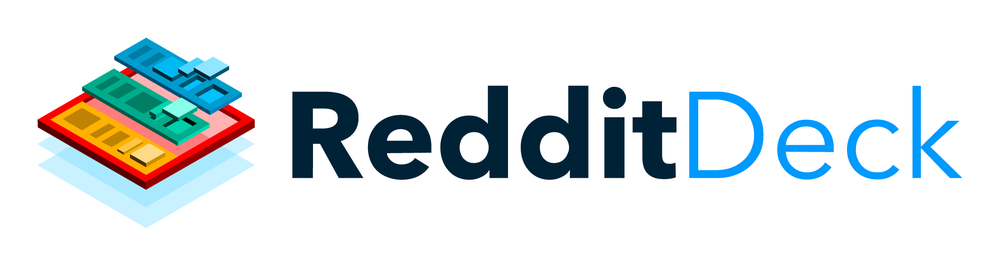

# 

[](http://commitizen.github.io/cz-cli/)

> TweetDeck for Reddit


## Using as Chrome extension

While the extension is being deployed to the Google play store, you can use `RedditDeck` as a Google Chrome extension manually.

1. `npm install`
2. `npm run build`. This generates a `dist` folder
3. Open Google Chrome and go to chrome://extensions 
4. Make sure `developer mode` is enabled.
5. Drag the `dist` folder from #2 into the extension page
6. All set

From this point on, while opening a new tab, you will see the `RedditDeck`. So you can stay updated with whatever you are following, with every new tab.

## Build Setup

```bash
# install dependencies
$ npm install

# serve with hot reload at localhost:3000
$ npm run dev

# build for production and launch server
$ npm run build
$ npm start

# generate static project
$ npm run generate
```
